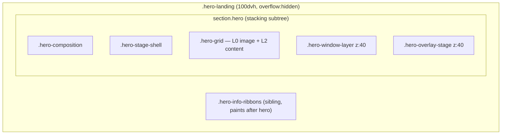
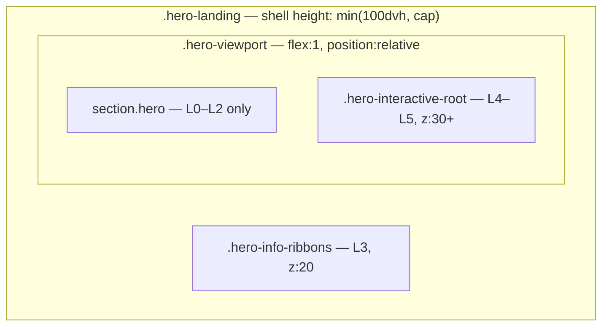

# Hero architecture

Self-contained first-viewport hero with a documented layer stack, viewport-based sizing (`100dvh`), and overflow rules that never clip user-triggered UI.

## Current structure (before stabilization)



## Root causes of layering problems

1. **Stacking context trap** — Floating windows and panels live inside `section.hero`. Ribbons are a *later sibling* in `.hero-landing`. The entire hero subtree paints before ribbons, so interactive UI could never reliably appear above ribbons when dragged downward.
2. **Duplicate z-index (40)** — `.hero-window-layer` and `.hero-overlay-stage` both used hardcoded `z-index: 40` with no ordering guarantee between cards and panels.
3. **Conflicting overflow** — Mobile rules first set `.hero-landing { overflow: visible }` then later re-lock with `overflow: hidden` on `.hero`, clipping panels.
4. **Mixed height sources** — Base `.hero-grid` used `min-height: clamp(520px, 58vh, 700px)` while landing shell used `100dvh` flex math; `vh` vs `dvh` mixed.
5. **Three rule sets** — Base `.hero`, `.hero-landing`, and breakpoint blocks duplicated height/overflow with different values.

## Target structure



## Layer system

| Layer | Token | z-index var | DOM / selector |
|------:|-------|-------------|----------------|
| 0 | background | `--hero-z-bg` (0) | `.hero-right`, `.hero-bmw*` |
| 1 | gradient | `--hero-z-gradient` (1) | `.hero::before`, `.hero::after`, `.hero-grid::before`, `.hero-bmw-blend` |
| 2 | content | `--hero-z-content` (10) | `.hero-left`, `.hero-grid` copy |
| 3 | ribbons | `--hero-z-ribbons` (20) | `.hero-info-ribbons` |
| 4 | cards | `--hero-z-cards` (30) | `.hero-interactive-root .hero-window-layer` |
| 5 | panels | `--hero-z-panels` (40) | `.hero-interactive-root .hero-overlay-stage` |
| 6 | modals | `--hero-z-modals` (50) | Reserved |

Window-internal stacking uses incremental z-index from `HeroWindowManager` *within* layer 4.

## Viewport sizing

```css
--hero-viewport-height: calc(100dvh - var(--site-nav-current-height));
--hero-shell-height: min(100dvh, var(--hero-viewport-cap));
```

- **Shell** (`.hero-landing`) = one screen including ribbons.
- **Viewport** (`.hero-viewport`) = shell minus ribbon tracks + gap — the cinematic stage.
- Navbar clearance uses `--site-nav-current-height` (updated by `SiteHeader` on scroll).

## Overflow policy

| Element | overflow-x | overflow-y | Why |
|---------|------------|------------|-----|
| `.hero-landing` | visible | visible | Never clip user panels |
| `.hero-viewport` | visible | visible | Positioning root for interactive layer |
| `.hero` | clip | visible | Clip horizontal BMW bleed only |
| `.hero-composition` | visible | visible | Slider-ready stack root |
| `.hero-right` | hidden | hidden | Decorative image column only |
| `.hero-interactive-root` | visible | visible | Drag bounds for windows/panels |

## Slider readiness

Each slide is wrapped in `.hero-slide[data-hero-slide="n"]` inside `.hero-stage-shell`. Interactive UI stays in `.hero-interactive-root` so slide transitions do not affect panel stacking.

## Files

- `app/globals.css` — tokens, viewport shell, layer selectors
- `components/hero/HeroLandingShell.tsx` — viewport + interactive root
- `components/hero/PremiumHero.tsx` — splits hero content vs interactive slot
- `components/hero/HeroOverlayStage.tsx` — layer 5 surface
- `lib/hero/layers.ts` — layer ids and CSS var names
